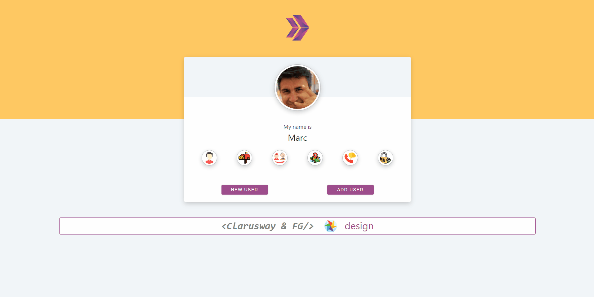

# Random User App 2

## Description

- *This App was build with React*

## In Random User App 2

### I have used to

- axios for fetching data from Random User API,

- Local state,

- map function for monitoring data in table.

## Outcome:

## Objective

Build a Random User App using ReactJS.

**
&#9786; Thanks for visiting &#9997;
**
